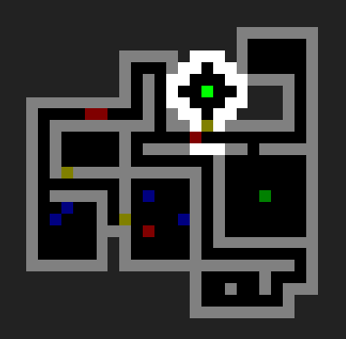

# dungeon
> Pixel-based roguelike

[Play it in your browser!](https://semibran.github.io/roguelike)



## Features
- Fancy procedural dungeon generation algorithm creates interesting and unique levels
- Fast shadowcasting field-of-view algorithm
- Energy-based turn system (reminiscent of Angband)
- Secret rooms!

## Instructions
Click to move the hero. For navigating tight, mysterious corridors, try using the arrow keys or `WASD`.
- `Green`: The aforementioned hero. He looks just like you, doesn't he?
- `Yellow`: A door. Move towards it to open it, and press `C` to slam it shut.
- `Red`: These baddies are monsters that wander around endlessly - hit them from the side to get rid of 'em, but just try to stay out of their way.
- `Dark red`: This is a corpse, indicating that you probably just killed something. It could also mean you just got trashed. Congratulations!
- `Blue`: A generic item. Pick it up if it bothers you, but don't expect it to do anything.
- `Dark green`: A staircase leading to a new floor. Press `>` to descend - more somewhat repetitive adventures await!
- `Gray`: A staircase leading back up to a previous floor. It won't do anything if you're on the first floor, but otherwise you can press `<` to use it.

Once you die (everyone does), just press `R` to restart. You could also do so mid-game, but you'd lose all your totally valuable progress. We wouldn't want that now, would we?

[Anyways, enough chit-chat - get out there and start exploring!](https://semibran.github.io/roguelike)

## Installation
```sh
$ git clone https://github.com/semibran/roguelike
...
$ cd roguelike
$ npm install
```

Run `npm start` to run a `reload` server on port `8080`.

## License
MIT
